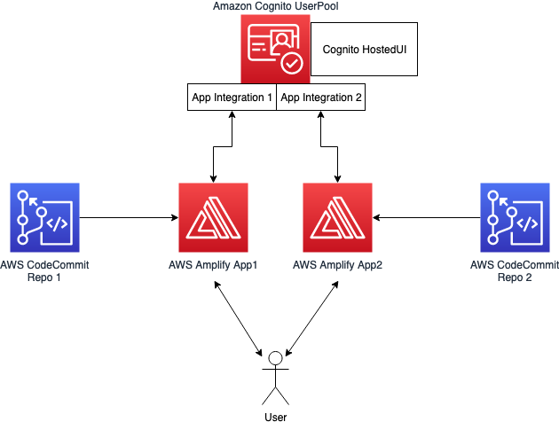
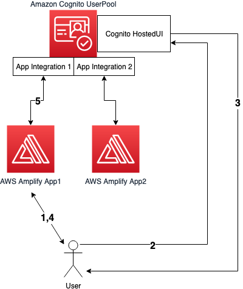

# cognito-shared-login-demo
A project demonstrating how to use Amazon Cognito user pool as a OAuth2 provider for two distincts applications.

## Description

The project is composed of an infrastructure backend composed of an Amazon Cognito user pool with two app integrations and the Hosted UI activated.

The project is also composed of 2 AWS Amplify applications using that Cognito as the authentication provider in OAuth2 mode. 

With this architecture, the end user can use the same credentials between the two applications. Thanks to the use of Cognito User Pool Hosted UI, the end user can login to the application 1 and then do not need to re enter his credentials when he wants to login to application 2.

The two applications are simple applications requesting the user to log in and displaying his username when he is logged in.

## The authentication process

1 : A user request the Amplify App 1

2 : The user is redirected to the Cognito hosted UI and enter valid credentials

3 : Cognito returns a token and redirect the user to the Amplify App

4 : The Amplify App validate the token in Cognito and authorize the user to access the app

## Usage

Clone the repository on your local machine and run the following command *"make DeployUserPool COGNITODOMAIN=yourcognitodomainname"*.

This command will:

- Build the CDK environment for the app backend. The backend is composed of:
    - A Cognito UserPool with the client integrations
    - Two code commit repositories
    - Two Amplify applications linked to the code commit repositories
- Deploy the backend infrastructure using AWS CDK command line
- Setup the configuration files for the two amplify applications
- Remove the link between the folder and GitHub by running "*rm -rf .git*"
- Push the two files on the two code commit repositories created during the first step. This will automatically build and deploy the applications in Amplify.

The two applications are written in React.

**Important: ** The cognito domain name in parameter shall be unique.
